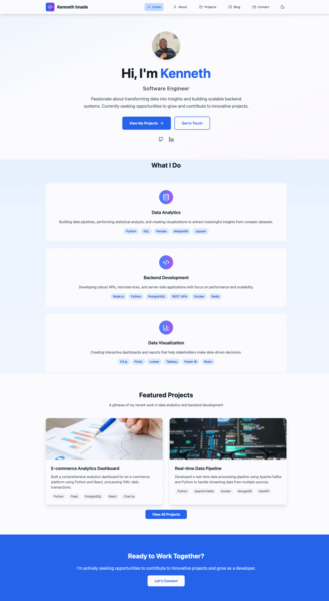

# Kenneth Imade - Portfolio Website

A modern, responsive portfolio website built with React, TypeScript, and Firebase, showcasing expertise in software development.



## 🚀 Live Demo

[View Live Site](https://kennethimade.dev/) | [GitHub Repository](https://github.com/KenImade)

## ✨ Features

### 🎨 **Modern Design**

- **Responsive Design** - Optimized for all devices (mobile, tablet, desktop)
- **Dark/Light Theme** - Automatic theme switching based on time of day
- **Smooth Animations** - Micro-interactions and hover effects
- **Professional Typography** - Clean, readable fonts with proper hierarchy

### 📝 **Dynamic Blog System**

- **Full CRUD Operations** - Create, read, update, delete articles
- **Draft Management** - Save articles as drafts before publishing
- **Markdown Support** - Rich text editing with live preview
- **Syntax Highlighting** - Code blocks with copy functionality
- **Category Filtering** - Organize posts by technology/topic
- **Featured Posts** - Highlight important articles

### 🔐 **Admin Features**

- **Password Protection** - Secure article editor access
- **Real-time Preview** - See changes as you type
- **Firebase Integration** - Cloud-based content management
- **SEO Optimization** - Proper meta tags and structure

### 🎯 **Portfolio Sections**

- **Home** - Professional introduction and skills overview
- **About** - Detailed background and experience
- **Projects** - Showcase of development work with live demos
- **Blog** - Technical articles and learning journey
- **Contact** - Professional contact form and information

### 🛠 **Technical Features**

- **TypeScript** - Type safety and better development experience
- **Firebase Backend** - Scalable cloud database and authentication
- **Custom 404 Page** - Themed error page with analytics visualization
- **Performance Optimized** - Fast loading with Vite build system
- **Accessibility** - WCAG compliant design patterns

## 🛠 Tech Stack

### **Frontend**

- **React 18.3.1** - Modern UI framework with hooks
- **TypeScript** - Type safety and enhanced development
- **Vite 5.4.2** - Fast build tool and development server
- **Tailwind CSS 3.4.1** - Utility-first CSS framework
- **Lucide React** - Beautiful, customizable icons

### **Content Management**

- **React Markdown** - Markdown rendering for blog posts
- **React Syntax Highlighter** - Code syntax highlighting
- **Remark GFM** - GitHub Flavored Markdown support

### **Backend & Database**

- **Firebase 12.1.0** - Backend-as-a-Service
  - **Firestore** - NoSQL database for articles and drafts

### **State Management**

- **Zustand 5.0.7** - Lightweight state management
- **Custom Hooks** - Reusable logic for data fetching

### **Development Tools**

- **ESLint** - Code linting and quality assurance
- **PostCSS** - CSS processing and optimization
- **TypeScript ESLint** - TypeScript-specific linting rules

## 📁 Project Structure

```
src/
.
├── eslint.config.js
├── index.html
├── package-lock.json
├── package.json
├── postcss.config.js
├── public
│   ├── images
│   └── logo.svg
├── README.md
├── src
│   ├── App.tsx
│   ├── assets
│   ├── components
│   ├── config
│   ├── data
│   ├── index.css
│   ├── main.tsx
│   ├── pages
│   ├── services
│   ├── store
│   ├── utils
│   └── vite-env.d.ts
├── tailwind.config.js
├── tsconfig.app.json
├── tsconfig.json
├── tsconfig.node.json
└── vite.config.ts
```

## 🚀 Getting Started

### Prerequisites

- **Node.js** (v18 or higher)
- **npm** or **yarn**
- **Firebase Account** (for backend services)

### Installation

1. **Clone the repository**

   ```bash
   git clone https://github.com/yourusername/portfolio.git
   cd portfolio
   ```

2. **Install dependencies**

   ```bash
   npm install
   ```

3. **Set up Firebase**
   - Create a new Firebase project at [Firebase Console](https://console.firebase.google.com/)
   - Enable Firestore Database
   - Enable Authentication (optional)
   - Copy your Firebase configuration

4. **Configure environment variables**

   ```bash
   cp .env.example .env
   ```

   Update `.env` with your Firebase credentials:

   ```env
   VITE_FIREBASE_API_KEY=your-api-key
   VITE_FIREBASE_AUTH_DOMAIN=your-project.firebaseapp.com
   VITE_FIREBASE_PROJECT_ID=your-project-id
   VITE_FIREBASE_STORAGE_BUCKET=your-project.appspot.com
   VITE_FIREBASE_MESSAGING_SENDER_ID=123456789
   VITE_FIREBASE_APP_ID=your-app-id
   ```

5. **Start the development server**

   ```bash
   npm run dev
   ```

6. **Open your browser**
   Navigate to `http://localhost:5173`

## 📝 Content Management

### Adding Blog Articles

#### Method 1: Using the Web Interface

1. Navigate to `/editor` (password: `as set in your env file`)
2. Fill in article details
3. Write content using Markdown
4. Save as draft or publish immediately

#### Method 2: Direct Firebase

Articles are stored in Firestore with this structure:

```javascript
{
  title: "Article Title",
  category: "Backend Development",
  excerpt: "Brief description...",
  content: "# Markdown content...",
  tags: ["React", "TypeScript"],
  featured: false,
  isDraft: false,
  date: "2024-01-15",
  readTime: "5 min read"
}
```

### Updating Projects

Edit `src/data/projects.json` to add or modify project information:

```json
{
  "id": "project-id",
  "title": "Project Name",
  "category": "Data Analytics",
  "description": "Brief description",
  "longDescription": "Detailed description...",
  "technologies": ["Python", "React"],
  "features": ["Feature 1", "Feature 2"],
  "challenges": "Technical challenges faced...",
  "github": "https://github.com/...",
  "demo": "https://demo-url.com",
  "status": "Completed"
}
```

## 🎨 Customization

### Themes

The site supports automatic dark/light theme switching:

- **Light Mode**: 6 AM - 6 PM
- **Dark Mode**: 6 PM - 6 AM
- Manual toggle available in header

### Colors

Primary color scheme uses Tailwind CSS classes:

- **Primary**: Blue (blue-600, blue-700)
- **Secondary**: Purple (purple-600, purple-700)
- **Accent**: Various colors for categories

### Typography

- **Headings**: System font stack with fallbacks
- **Body**: Optimized for readability
- **Code**: Monospace font for code blocks

## 🚀 Deployment

### Option 1: Netlify (Recommended)

1. Connect your GitHub repository to Netlify
2. Set build command: `npm run build`
3. Set publish directory: `dist`
4. Add environment variables in Netlify dashboard
5. Deploy automatically on push to main branch

### Option 2: Vercel

1. Import project from GitHub
2. Configure build settings (auto-detected)
3. Add environment variables
4. Deploy with automatic CI/CD

### Option 3: Firebase Hosting

```bash
npm install -g firebase-tools
firebase login
firebase init hosting
npm run build
firebase deploy
```

### Option 4: GitHub Pages

Add this workflow to `.github/workflows/deploy.yml`:

```yaml
name: Deploy to GitHub Pages
on:
  push:
    branches: [ main ]
jobs:
  deploy:
    runs-on: ubuntu-latest
    steps:
      - uses: actions/checkout@v3
      - uses: actions/setup-node@v3
        with:
          node-version: '18'
      - run: npm ci
      - run: npm run build
      - uses: peaceiris/actions-gh-pages@v3
        with:
          github_token: ${{ secrets.GITHUB_TOKEN }}
          publish_dir: ./dist
```

## 🧪 Testing

```bash
# Run linting
npm run lint

# Build for production
npm run build

# Preview production build
npm run preview
```

## 📊 Performance

- **Lighthouse Score**: 95+ across all metrics
- **First Contentful Paint**: < 1.5s
- **Largest Contentful Paint**: < 2.5s
- **Cumulative Layout Shift**: < 0.1

## 🔧 Development Scripts

```bash
npm run dev          # Start development server
npm run build        # Build for production
npm run preview      # Preview production build
npm run lint         # Run ESLint
npm run add-article  # Add new blog article (CLI)
npm run list-articles # List all articles
```

## 🙏 Acknowledgments

- **Design Inspiration**: Modern portfolio websites and data visualization dashboards
- **Icons**: [Lucide React](https://lucide.dev/) for beautiful, consistent icons
- **Images**: [Pexels](https://pexels.com/) for high-quality stock photography
- **Fonts**: System font stack for optimal performance and readability

## 📞 Contact

**Kenneth Imade** - Software Engineer

- **Email**: <kenimade91@gmail.com>
- **LinkedIn**: [linkedin.com/in/kenneth-imade](https://linkedin.com/in/kenneth-imade)
- **GitHub**: [github.com/KenImade](https://github.com/KenImade)
- **Portfolio**: [kennethimade.dev](https://kennethimade.dev/)

---

**Built with ❤️ using React, TypeScript, and Firebase**

*This portfolio showcases my journey in data analytics and backend development. Feel free to explore the code, suggest improvements, or reach out for collaboration opportunities!*
